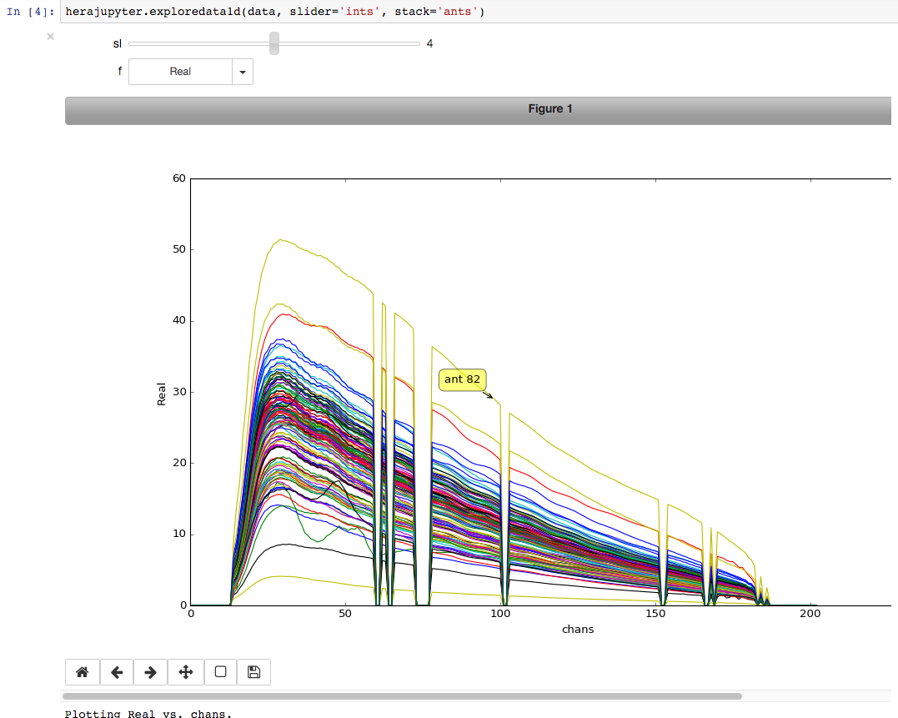
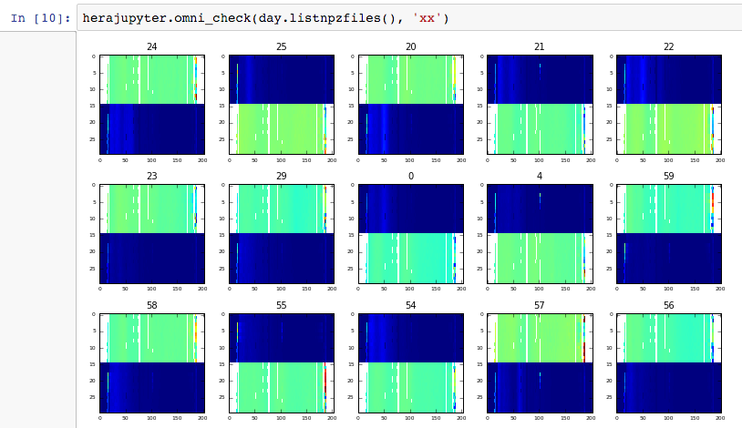

# HERA Jupyter

Integrating HERA/PAPER data with Jupyter notebooks. The goal is to use notebooks to document calibration pipeline and simplify interaction with data. A focus is to solve the day-long cycle observation -> analysis -> data quality check.

## Features

* dataset abstraction -- use a string to select a set of data (e.g., from a given day) for inspection
* interactive plotting -- read data for a given selection and interact with sliders to inspect

## Use Cases

1) HERA calibration pipeline can be scripted and saved as notebook and html.

2) Manual execution for interacting with data in human-in-the-loop analysis.

See a demo HERA (PAPER) pipeline processing in notebook at [https://github.com/caseyjlaw/jupyter-notebooks/blob/master/hera/hera_pipeline_demo.ipynb]

## Screen shots

## Installation

* git clone http://github.com/caseyjlaw/herajupyter.git
* cd herajupyter
* python setup.py install
